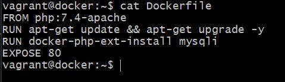
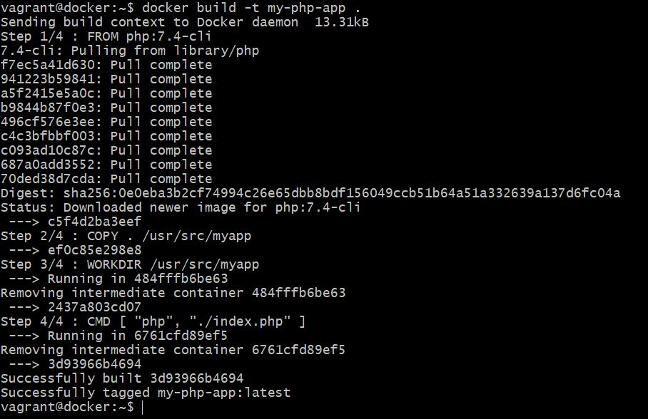
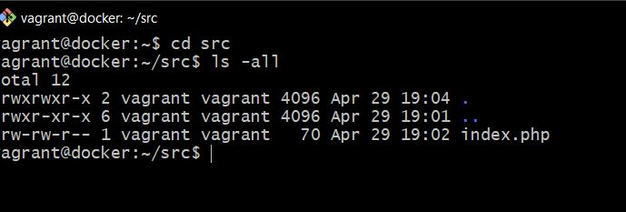
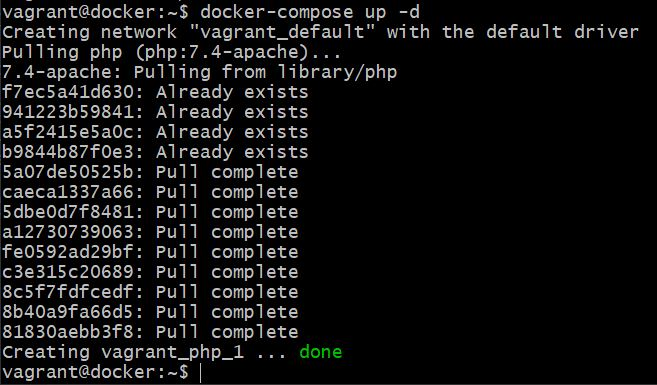
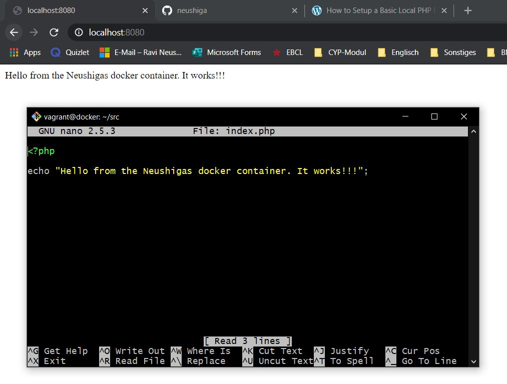
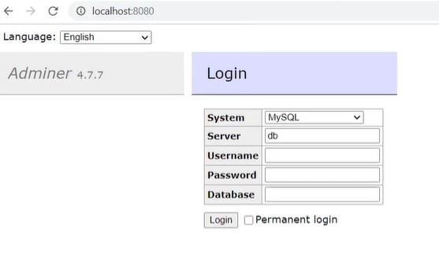
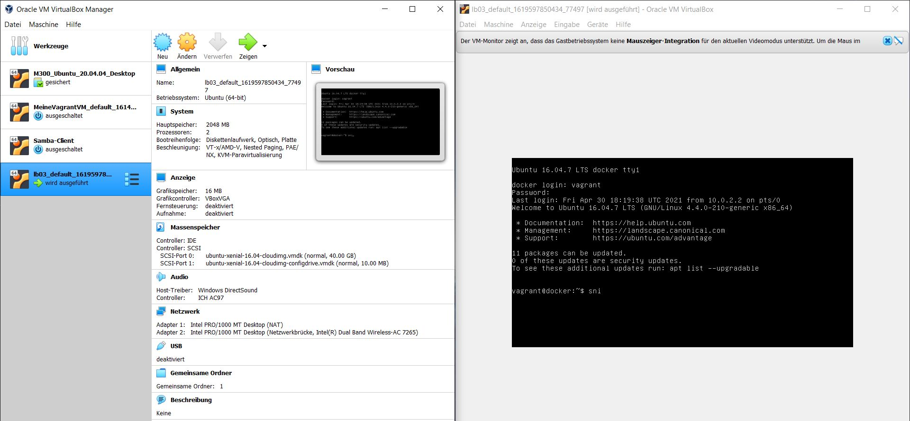

# PHP Datenbankzuegriff via Apache

## Inhaltsverzeichnis
1. Einleitung
2. Code Beschreibung
3. Testen
4. Korrekteheit der Angaben
5. Grafische Darstellung
6. Quellenangaben

## 1. Einleitung
Ich erstelle ein Docker-Compose, die eine MySQL-Datenbank per MyPHP ins LAN zu Verfügung stellt. Als Grundlage für Docker nehme ich eine Kopie der VM, welche Herr Berger in seinem M300 Github zur Verfügung stellt.

## 2. Code Beschreibung

Im bereits existierenden m300_lb Ordner einen Unterordner Namens lb03 erstellen.
Die zur Verfügung gestellte Vagrantfile vom Master ins lb03 Verzeichnis herüber kopieren.
```bash Codiger Code ist hier gecoded
cd m300_lb\
mkdir lb03
```

Anschliessend im Verzeichnis Git Bash öffnen und die VM mit folgendem Befehl starten und die SSH Verbindung aufbauen.
```bash Codiger Code ist hier gecoded
vagrant up
vagrant ssh
```


### Dockerfile

Ich erstelle ein Dockerfile mit folgendem Commando: 
```bash Codiger Code ist hier gecoded
nano Dockerfile
```

In diesem File wird folgendes geschrieben: In der ersten Zeile wird das **PHP: 7.4-Apache-Image** verwendet, um den Container zu erstellen. In der zweiten Zeile wird ein Befehl zum Updaten benutzt und mit **-y** angeben. Somit wird während der Installation nicht nachgefragt. In der dritten Zeile installieren ich mysqli. 
```bash Codiger Code ist hier gecoded
FROM php:7.4-apache
RUN apt-get update && apt-get upgrade -y
RUN docker-php-ext-install mysqli
```

Mit ```cat Dockerfile``` gibt die Kommandozeile direkt aus, was im File abgespeichert wurde.

 


### Index-File

Das Index-File erstellen wir wie folgt:
```bash Codiger Code ist hier gecoded
nano index.php
```

In dem File schreiben wir den unteren Text rein. Dieser wird später in der Kommandozeile und im Webbroweser angezeigt. Damit können wir vorerst überprüfen, ob die Schritte bisher stimmen.
```bash Codiger Code ist hier gecoded
<?php

echo "Hello from the docker container";
```


### Docker Image

Nun erstellen wir das Docker Image **my-php-app** mit folgendem Befehl. 
```bash Codiger Code ist hier gecoded
docker build -t my-php-app .
```

Es wird einen Moment dauer bis es alle Informationen hat.




Nach dem des gebildet wurde, lassen wir **my-running-app** laufen.
```bash Codiger Code ist hier gecoded
docker run -it --rm --name my-running-app my-php-app
```

Nun sollte es den Text, den wir im Index-File geschrieben hatten, anzeigen:

 


### PHP und Docker-Compose

Bevor wir das Docker-Compose File erstellen, schalten wir vorerst die Container aus:
```bash Codiger Code ist hier gecoded
docker stop $(docker ps -a -q)
```

Um zu sehen, ob wirklich die Container gestoppt wurden, können wir diesen Befehl ausführen:
```bash Codiger Code ist hier gecoded
docker ps
```

Wir erstellen ein Docker-Compose File: 
```bash Codiger Code ist hier gecoded
nano docker-compose.yml
```

Wir legen die Versionsnummer vom Docker-Compose auf **3.1**. Dann haben wir die Dienste. Der PHP Container benutzt das **Image php:7.4-apache** und der **Port 80:8080**. Auf der Linken Seite ist der Port unserem lokalen Computer und auf der rechten Seite der Port des Containers Schliesslich werden wir den Inhalt unseres ./src-Ordners in den Container **/var/www/html** Ordner haben. 
```bash Codiger Code ist hier gecoded
nano docker-compose.yml
version: '3.1'

services:
  php:
    image: php:7.4-apache
    ports:
      - 80:8080
    volumes:
      - ./src:/var/www/html/
```

Damit es funktioniert, müssen wir einen src Ordner - kann auch als php Ordner benannt werden - erstellen und den Index File in diesem Ordner verschieben.
```bash Codiger Code ist hier gecoded
mkdir src
mv index.php /home/vagrant/src
```

Überprüfungen können wir es, in dem wir ins Verzeichnis **src** wechseln und den ganzen Inhalt dort ausgeben:
```bash Codiger Code ist hier gecoded
cd src
ls -all
```

 


Mit **cd** gehen wir zurück ins Stammverzeichnis und starten die Container:
```bash Codiger Code ist hier gecoded
docker-compose up -d
```

Hier sehen wir, dass die Container ohne Probleme gestartet haben:

 


Nun geben wir im Browser localhost:8080 ein und wir sehen den Text, den im Index-File geschrieben hatten. Ich habe den Text im Nachhinein abgeändert. Es ist egal, was man hineinschreibt, nur muss dieser Text im Broswer übereinstimmen. Somit weiss man, dass bis hierhin alles geklappt hat:

 


Wir stellen zunächst den Container ab, bevor wir weitermachen:
```bash Codiger Code ist hier gecoded
docker-compose down
```


### MySQL

Wir öffnen das Docker-Compose File und müssen dort einige Einstellungen ändern, da wir zum Verbinden von PHP mit MySQL einige fehlende Teile in unserer PHP-Umgebung installieren müssen:
```bash Codiger Code ist hier gecoded
# Use root/example user/password credentials
version: '3.1'

services:
  php:
    build:
      context: .
      dockerfile: dockerfile
    ports:
      - 80:8008
    volumes:
      - ./src:/var/www/html/

  db:
    image: mysql
    command: --default-authentication-plugin=mysql_native_password
    restart: always
    environment:
      MYSQL_ROOT_PASSWORD: root

  adminer:
    image: adminer
    restart: always
    ports:
      - 8080:8080
```

Jetzt haben wir den **db**-Dienst hinzugefügt, der das MySQL-Image ist. Als MySQL_Root_Passwort habe ich **root** gesetzt. Der Administrator erhält das Administratorbild und setzt die Portzuordnung auf 8080:8080. Nun wäre alles gesetzt und wir können testen, ob es funktioniert.


## 3. Testen

Testen können wir es in dem wir im Browser "localhost:8080" eingeben, sollte der Adminer erscheinen mit dem man MySQL verwalten kann.

 

Ebenfalls war die Ausgabe vom index.php File ein Testing:


## 4. Korrekteheit der Angaben

 


## 5. Grafische Darstellung
 


## 6. Quellenangaben

### Markdown
https://www.markdownguide.org/basic-syntax/

### ubuntu/xenial64 Box Webseite 
https://app.vagrantup.com/boxes/search

### Youtube Videos zu Apache, PHP & MySQL
https://www.youtube.com/watch?v=_mwWxgfZ7Zc&ab_channel=NevyanNeykov

https://www.youtube.com/watch?v=ThpnqYpvnIM&ab_channel=TruthSeekers
